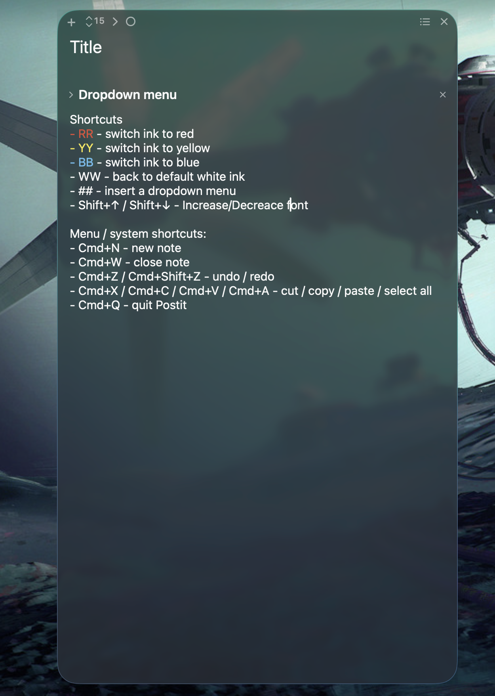

# Postit

Native macOS post-it notes on real Liquid Glass. One Swift file, zero
dependencies, no Xcode project - just AppKit and `swiftc`.

Dark glassy notes that float on your desktop and get out of your way: no Dock
icon, no title bars, just a menu-bar icon and the notes themselves.




## Features

- **Liquid Glass** - real `NSGlassEffectView` material (macOS 26+), with a
  brighter tint while focused so the glass doesn't dim under you
- **Rich text that auto-saves** - every keystroke is debounced to disk; notes
  restore their content, position, size, and font across launches
- **Collapsible sections** - Obsidian-style folds with editable titles,
  inserted at the cursor from the toolbar chevron
- **Ink swatches** - hover the ring in the toolbar and red/yellow/blue slide
  out; click one to color the selection and your typing from there on
- **Double-tap shortcuts** - type `RR`, `YY`, or `BB` for ink, `WW` for white,
  `##` for a new section; both characters vanish, replaced by the action
- **Font stepping** - toolbar chevrons with a live size readout, or
  Shift+Up/Down right at the cursor
- **Multi-note** - "+" spawns another note; a menu-bar switcher lists every
  saved note so you can reopen (or delete) any
- Sentence auto-capitalization, style-normalized paste, per-note JSON storage

## Shortcuts

Typing shortcuts fire on a double-tapped capital trigger - type it twice in a
row and both characters vanish, replaced by the action. They work in the note
body and in section titles. Ink shortcuts color the selection if you have one,
otherwise the ink you type with from the cursor on.

| Shortcut | Action |
| --- | --- |
| `RR` | red ink |
| `YY` | yellow ink |
| `BB` | blue ink |
| `WW` | back to default white |
| `##` | insert a collapsible section at the cursor |
| Shift+Up / Shift+Down | step the font size at the cursor |

Plus the standard menu shortcuts: Cmd+N new note, Cmd+W close note,
Cmd+Z / Cmd+Shift+Z undo / redo, Cmd+X / C / V / A cut / copy / paste /
select all, Cmd+Q quit.

## Install

Runs on macOS 13 or later, Apple Silicon and Intel. On macOS 26 the notes are
real Liquid Glass; on older versions they fall back to a simpler translucent
blur panel.

**Easiest - no tools needed:**

1. Click the green **Code** button at the top of this page, then **Download ZIP**.
2. Double-click the downloaded ZIP to unzip it.
3. Inside the folder is **Postit** - drag it into your **Applications** folder.
4. First launch only: macOS blocks apps it can't verify. Double-click Postit
   once, then open **System Settings → Privacy & Security**, scroll down, and
   click **Open Anyway**.
5. That's it - look for the note icon in the menu bar at the top of the
   screen (there's no Dock icon on purpose).

**From source** (needs the Xcode command line tools):

```bash
cd Swift && ./build.sh    # compiles main.swift and installs /Applications/Postit.app
open /Applications/Postit.app
```

Notes are stored one JSON file each (rich text as base64 RTF) under
`~/Library/Application Support/Postit/notes/`.

## Repo layout

- `Swift/main.swift` - the entire app
- `Swift/build.sh` - compile + install script
- `versions/` - one snapshot per milestone, the app's full history at a glance
- `postit.py` - the earlier PySide6 prototype the Swift app grew out of
  (`Postit.command` launches it; `requirements.txt` covers it)

## License

MIT
