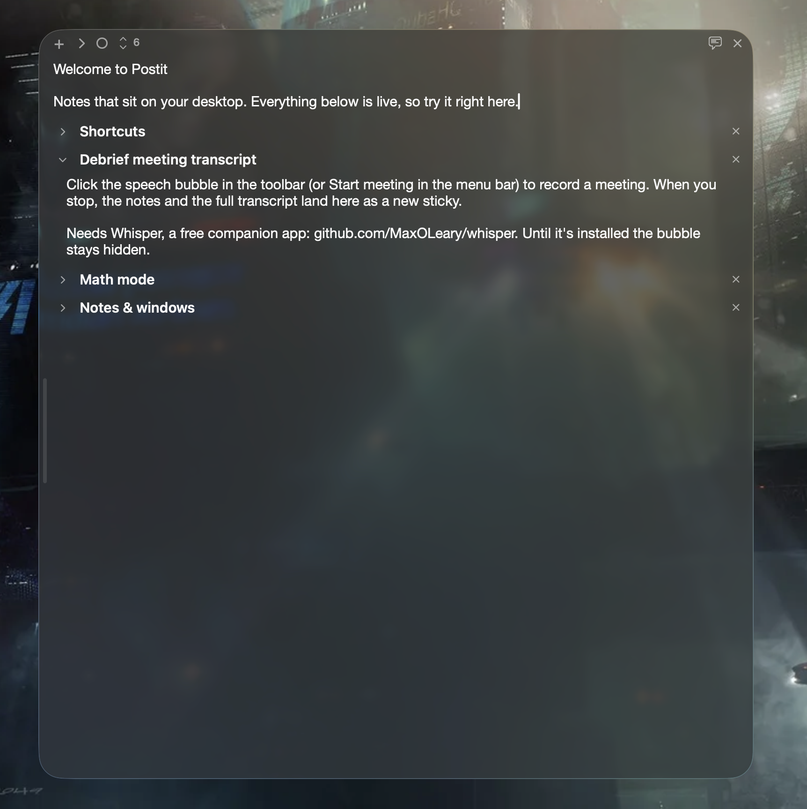

# Postit

Native macOS post-it notes on real Liquid Glass. One Swift file, zero
dependencies, no Xcode project - just AppKit and `swiftc`.

Dark glassy notes that float on your desktop and get out of your way: no Dock
icon, no title bars, just a menu-bar icon and the notes themselves.




## Features

- **Liquid Glass** - real `NSGlassEffectView` material (macOS 26+), with a
  brighter tint while focused so the glass doesn't dim under you
- **Rich text that auto-saves** - every keystroke is debounced to disk; notes
  restore their content, position, size, and font across launches
- **Collapsible sections** - Obsidian-style folds with editable titles,
  inserted at the cursor from the toolbar chevron
- **Ink swatches** - hover the ring in the toolbar and red/green/blue slide
  out; click one to color the selection and your typing from there on
- **Double-tap shortcuts** - type `RR`, `GG`, or `BB` for ink, `WW` for white,
  `##` for a new section; both characters vanish, replaced by the action
- **Font stepping** - toolbar chevrons with a live size readout, or
  Shift+Up/Down right at the cursor
- **Multi-note** - "+" spawns another note; a menu-bar switcher lists every
  saved note so you can reopen (or delete) any
- **Conjoinable notes** - drag a note onto another's edge and hold for a
  moment; the edge glows, and releasing merges them into one window with
  side-by-side columns. Grab the pill at a column's top-right corner to pull
  it back out into its own note
- **Hover to wake** - rest the pointer on an idle note and it takes focus with
  the cursor right where you left it, no clicking back in
- **Math mode** - type `:math` on a line and the lines below become a live
  calculator: arithmetic, percentages (`100 + 15%`), unit conversions
  (`13lb kg`, `72f to c`), currency (`25 eur in usd`, daily rates), and
  variables (`price = 40` ... `price + 8.5%`). Answers appear in green at the
  end of each line; they're painted, not text, so notes stay clean. `:end`
  turns it off. Lines that don't compute are just notes - never an error
- Sentence auto-capitalization (hold Shift while typing the letter to keep it
  lowercase), style-normalized paste, per-note JSON storage

## Shortcuts

Typing shortcuts fire on a double-tapped capital trigger - type it twice in a
row and both characters vanish, replaced by the action. They work in the note
body and in section titles. Ink shortcuts color the selection if you have one,
otherwise the ink you type with from the cursor on.

| Shortcut | Action |
| --- | --- |
| `RR` | red ink |
| `GG` | green ink |
| `BB` | blue ink |
| `WW` | back to default white |
| `##` | insert a collapsible section at the cursor |
| Shift+Up / Shift+Down | step the font size at the cursor |
| `:math` on its own line | live calculator for the lines below (`:end` stops it) |

Plus the standard menu shortcuts: Cmd+N new note, Cmd+W close note,
Cmd+Z / Cmd+Shift+Z undo / redo, Cmd+X / C / V / A cut / copy / paste /
select all, Cmd+Q quit.

## Install

Runs on macOS 11 (Big Sur) or later, Apple Silicon and Intel. On macOS 26 the
notes are real Liquid Glass; on older versions they fall back to a simpler
translucent blur panel.

**[Download Postit](https://github.com/MaxOLeary/postit/releases/latest/download/Postit.zip)**
- one ZIP, one app, always the newest build.

1. Double-click the downloaded ZIP. Out pops **Postit**.
2. Drag it into your **Applications** folder (or just double-click it right
   there).
3. First launch only: macOS blocks apps it can't verify. Right-click (or
   Control-click) **Postit** and choose **Open**, then click **Open** in the
   dialog. If your macOS version doesn't offer that, double-click Postit once,
   then allow it under **System Settings → Privacy & Security** (on Monterey
   and earlier: **System Preferences → Security & Privacy → General**) and
   click **Open Anyway**.
4. That's it - look for the note icon in the menu bar at the top of the
   screen (there's no Dock icon on purpose).

The green **Code → Download ZIP** button works too; the same `Postit.app` is
sitting at the top of the folder you get.

The very first launch opens a welcome note: a short tour of the app with the
whole shortcut list in it, written as a real note so you can try everything on
the spot. Clear it out whenever you like - it's only seeded once.

**From source** (needs the Xcode command line tools):

```bash
cd Swift && ./build.sh    # compiles main.swift and installs /Applications/Postit.app
                          # (--ship also refreshes the committed Postit.app)
open /Applications/Postit.app
```

Notes are stored one JSON file each (rich text as base64 RTF) under
`~/Library/Application Support/Postit/notes/`.

Optional: keep a readable Markdown copy of every note in a folder of your
choice (sections become `##` headers). One-way - the JSON stays the source of
truth, since Markdown can't hold the ink colors and font sizes:

```bash
defaults write com.maxoleary.postit MDMirrorFolder ~/wherever/notes
```

## Repo layout

- `Postit.app` - the ready-to-run app (what the download gives you)
- `Swift/main.swift` - the entire app, one file
- `Swift/build.sh` - compile + install script

## License

MIT
